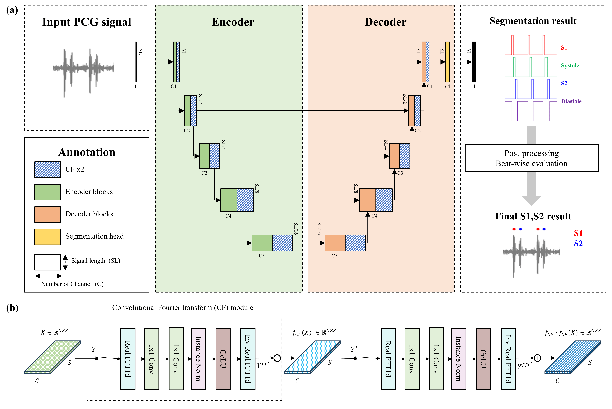

# PCG_FTSeg: Enhancement of Phonocardiogram Segmentation using Convolutional Neural Networks with Fourier transform Module
<p align="center"></p>

## Paper
This repository provides the official implementation code for the paper: **"Enhancement of Phonocardiogram Segmentation using Convolutional Neural Networks with Fourier transform Module."**

Authors: [Changhyun Park](https://github.com/brody9512), Keewon Shin, Jinew Seo, Hyunseok Lim, Gyeong Hoon Kim, Woo-
Young Seo, Sung-Hoon Kim, Namkug Kim
[MI2RL LAB](https://www.mi2rl.co/)<br/><br/>

## 💡 Highlights
+ Introduce an enhanced U-Net architecture integrated with Convolutional Fourier Transform (CF) modules that fuse time-domain convolution and frequency-domain analysis via FFT and iFFT, enabling precise extraction of both temporal and spectral features for accurate PCG segmentation.
+ Employ a dual CF module strategy—applied consecutively in both encoder and decoder layers—to robustly differentiate between S1 and S2 heart sounds and background noise, thereby significantly improving segmentation performance even in the presence of heart murmurs.
+ Validate the proposed approach on multiple datasets (internal PhysioNet 2016 and external PhysioNet 2022 and AMC), demonstrating superior performance with an average F1 score of 97.64% for S1 and S2 segmentation compared to state-of-the-art methods such as LR-HSMM, LSTM, and BiLSTM.

## Repository Structure
```
├── config.py 
├── dataset.py 
├── main.py 
├── model.py 
├── modules.py 
├── utils.py 
├── image 
│ └── model_figure.png 
├── preprocessing 
│ └── signal_2016_and_AMC.py 
│ └── signal_2022.py
```

## Requirements
- numpy >= 1.21.0
- scipy >= 1.7.0
- torch >= 1.10.0
- pytorch-lightning >= 1.6.0
- monai >= 0.9.0
- scikit-learn >= 1.0.0
- neurokit2 >= 0.1.9
- livelossplot >= 0.5.5
- matplotlib >= 3.4.0
- librosa >= 0.10.2
- natsort >= 8.4.0

## Script Example
```bash
python main.py --gpu 0 --ver [appropriate version identifier each time you run the script] --toler 40 --featureLength 6144 --target_sr 1000 --lowpass 20_200 --year 2016 --fft --twice
```

## Citation
If you use this code or find it useful in your research, please cite our paper:
```bibitex
@article{pcg_ftseg,
  title={Enhancement of Phonocardiogram Segmentation using Convolutional Neural Networks with Fourier transform Module},
  author={Changhyun Park and Keewon Shin and Jinew Seo and Hyunseok Lim and Gyeong Hoon Kim and Woo-Young Seo and Sung-Hoon Kim and Namkug Kim},
  year={2025}
}
```
